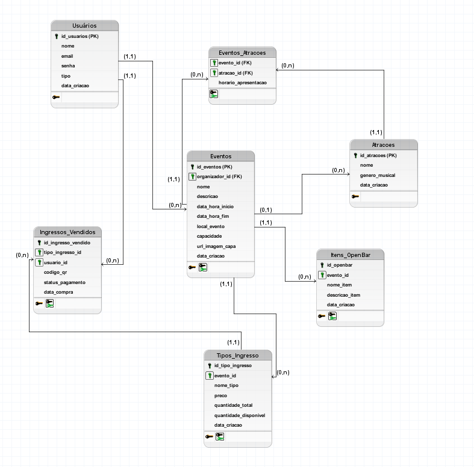

# Introdução
Primeiramente o banco de dados foi pensado e estruturado com base na análise dos requisitos funcionais e não funcionais do sistema "hosteador" de festas, como exemplo, o blacktag, com base nisso foi elaborado o seguinte modelo conceitual:

*   **Usuário:** Representa tanto os organizadores de eventos quanto os clientes.
*   **Evento:** Contém informações sobre as festas, como nome, data, local ...
*   **Atração/Artista:** Informações sobre os artistas que se apresentarão nos eventos.
*   **Ingresso:** Detalhes sobre os tipos de ingressos, preços e disponibilidade.
*   **Item Open Bar:** Itens oferecidos no serviço de open bar.

Os relacionamentos principais incluem:

*   Um Usuário organizador pode criar vários Eventos.
*   Um Evento é criado por um Usuário organizador.
*   Um Usuário (cliente) pode comprar vários Ingressos.
*   Um Ingresso pertence a um Usuário e a um Evento.
*   Um Evento pode ter várias Atrações e Artistas em seu line-up.
*   Uma Atração e Artista pode se apresentar em vários Eventos.
*   Um Evento pode oferecer vários Itens Open Bar.

### Modelo Lógico desenvolvido:

 Diagrama produzido no software brmodelo 

### Modelo Físico desenvolvido:
É possível encontrar no diretório o file bancoDeDados.sql, o qual contém a modelagem física do banco de dados.

## Considerações finais

Fiquei muito contente com o resultado final do projeto, foi uma longa jornada, cheia de bugs e erros, mas que no final foram superados e com resultado de valer apena. Ademais, acredito que esse site pode ir além de uma ponderada e virar uma aplicação web real, com alguns ajustes para o futuro, como a compra de ingressos, geração de relatórios, cdn para imagens e vídeos, compartilhamento via redes sociais...

